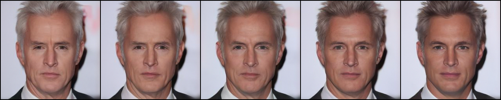
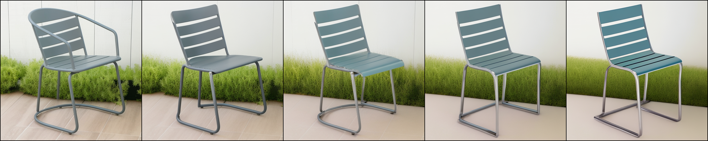
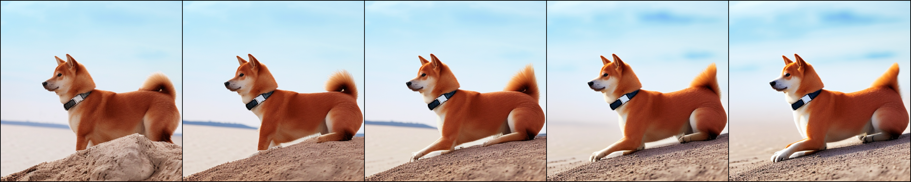

# Diffusion-Pullback
Official Implementation of [understanding the latent space of diffusion models through the lens of riemannian geometry](https://arxiv.org/abs/2307.12868) (NeurIPS 2023)

- examples

unsupervised editing



weekly-supervised editing (text-conditioned)


## Environment
```
conda create -n pullback python=3.10
pip install -r requirements.txt
```

## Experiemtns

- unconditional diffusion model

Currently, it's implemented only for CelebA-HQ. 

In the paper, we used the mode from [SDEdit](https://github.com/ermongroup/SDEdit), but since it's deprecated, here, we use a Hugging Face model here.

```
cd src
bash scripts/main_celeba_hf_local_encoder_pullback.sh
```

- stable diffusion 

If you want to experiment with a new image, you can do the following: 1) Insert the desired image into "datasets/examples", and 2) adjust the "sample_idx" accordingly.

[](https://colab.research.google.com/github/enkeejunior1/Diffusion-Pullback/blob/example-code.ipynb)

```
cd src
bash scripts/main_various_local_encoder_pullback_without_edit_prompt.sh     # w/o text condition
bash scripts/main_various_local_encoder_pullback_with_edit_prompt.sh        # w/ text condition
```
